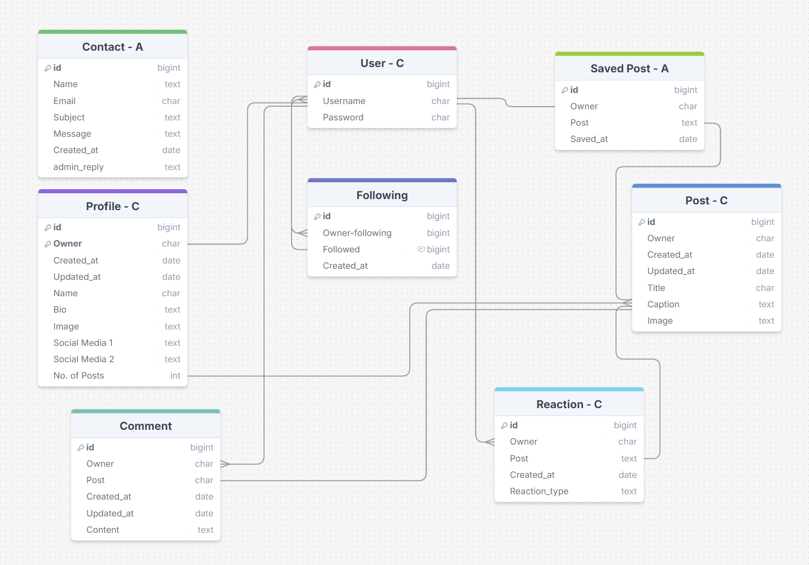
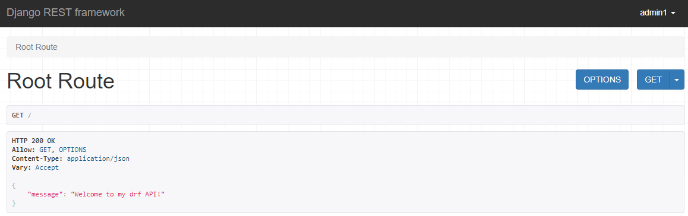
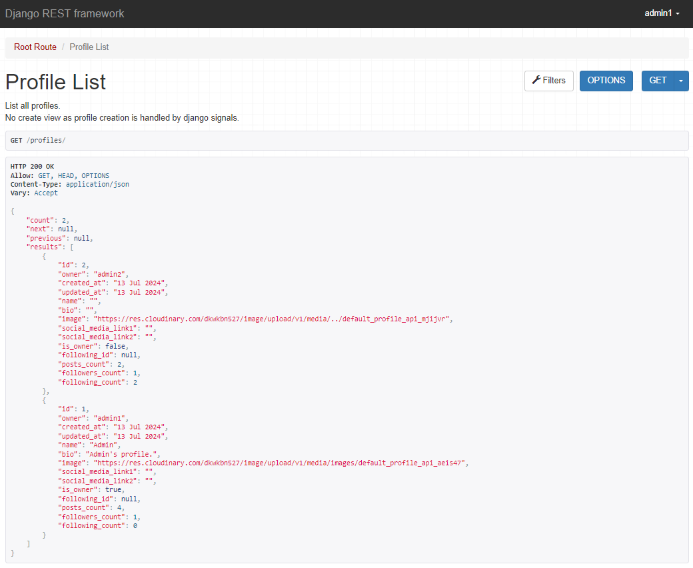
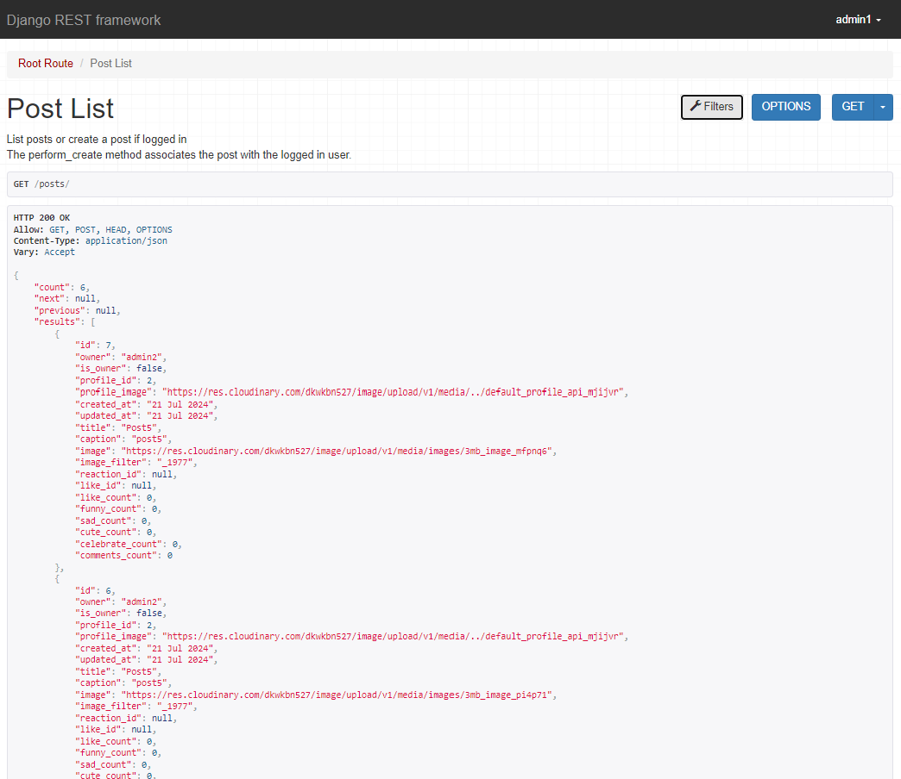
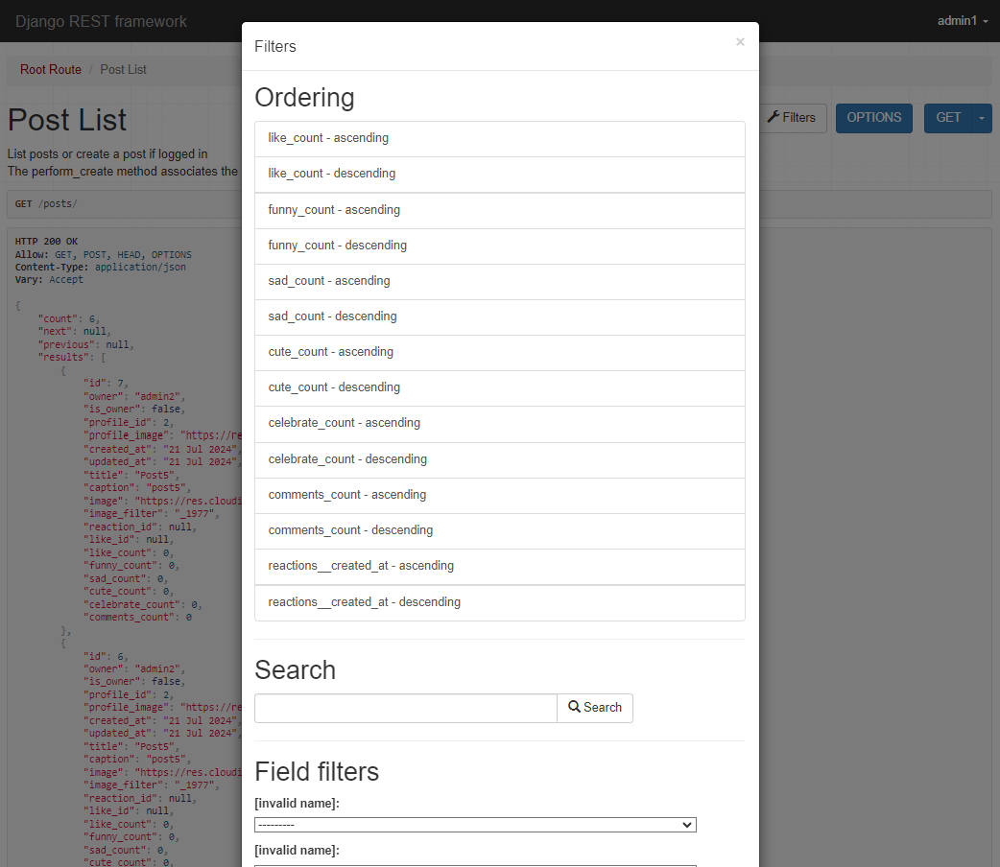
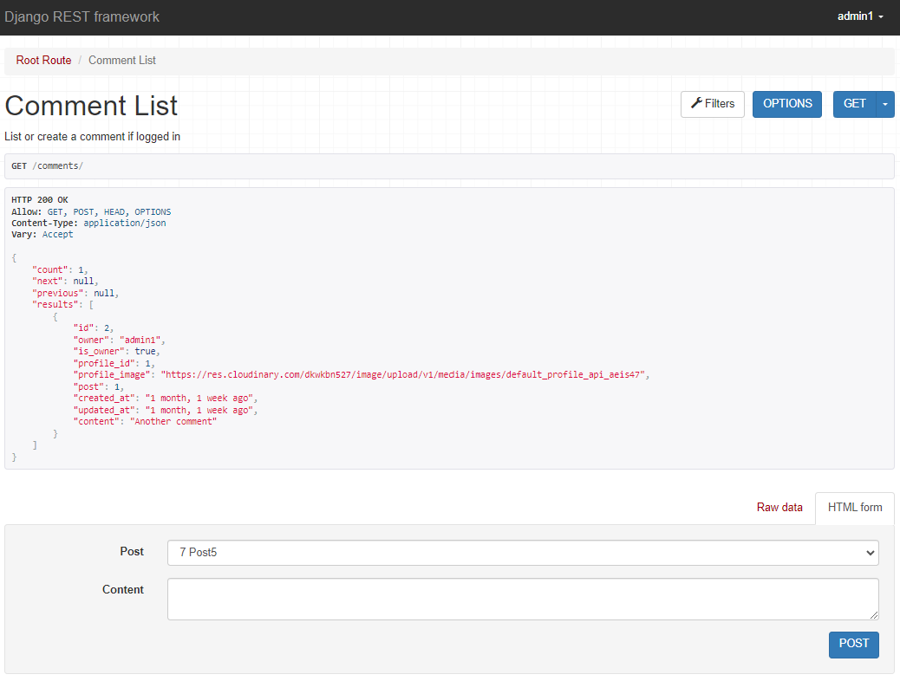
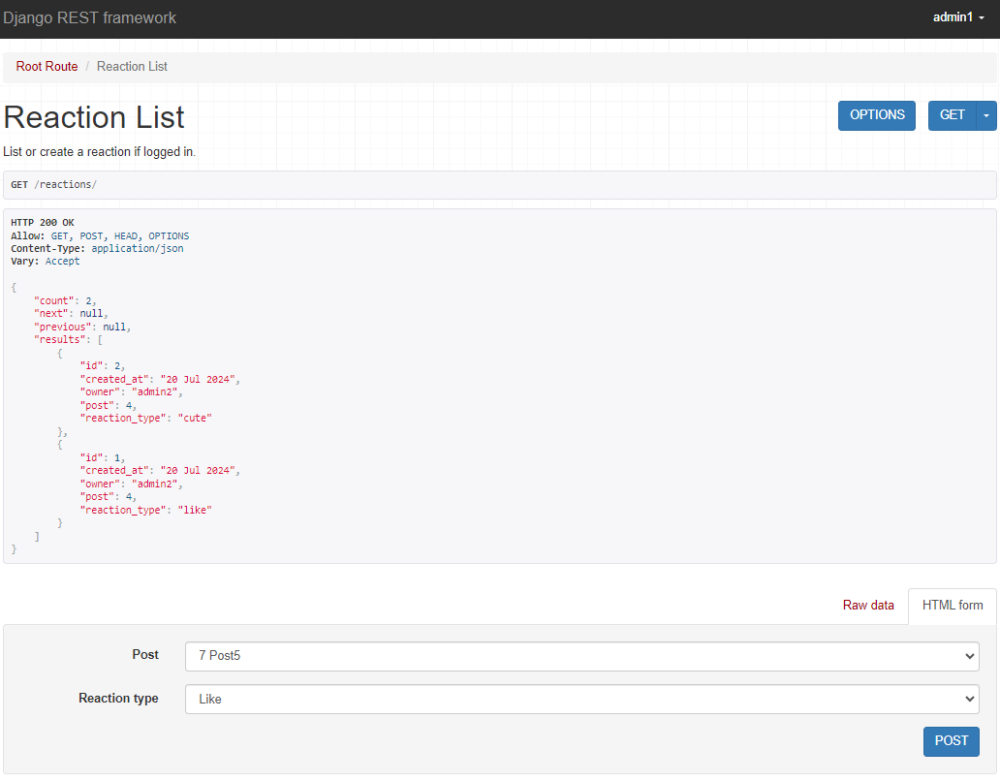
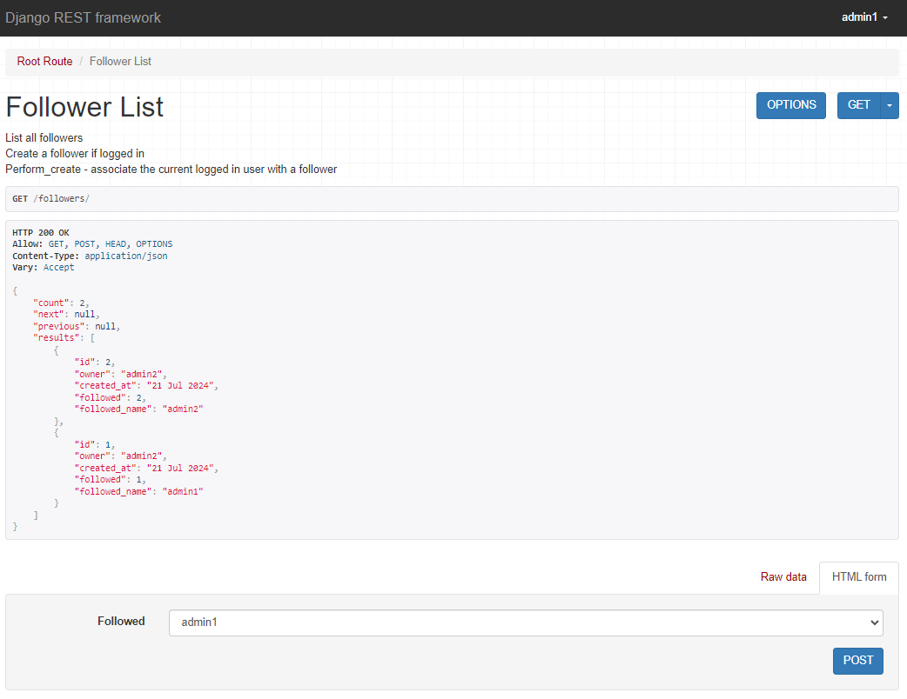
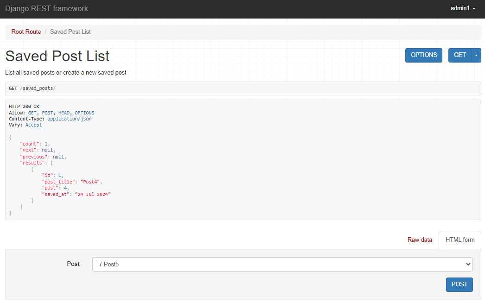
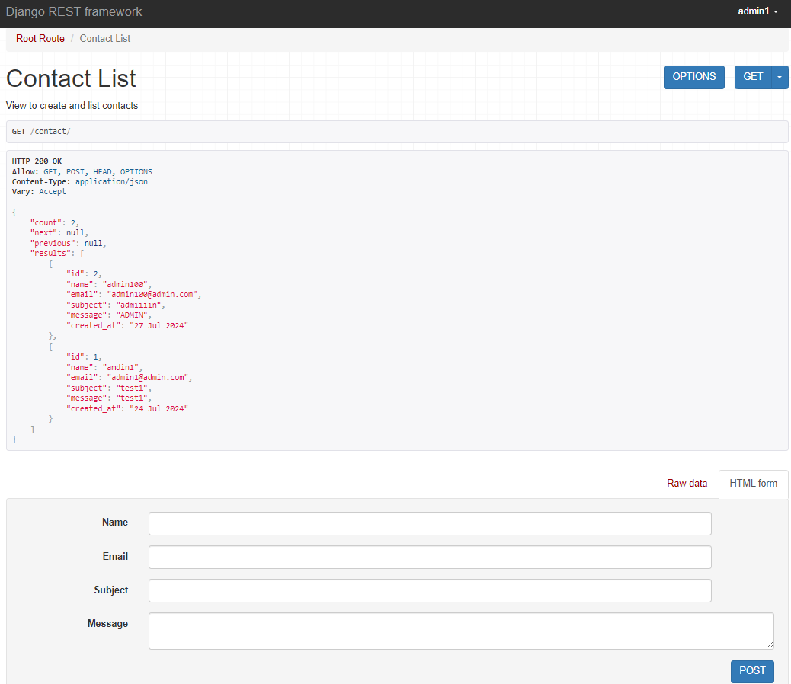

# Cat Snaps API

This is the back-end API used by the React application, [Cat Snaps](https://github.com/ShieldsJohn/cat-snaps)

## Project Aim

The aim of this API is provide database CRUD and user authentication functionality to Cat Snaps (insert deployed link) - a photo-sharing social media site, including features such as user profiles, posting images, commenting on and reacting to posts and following other users.

## Project Structure

The structure of this API project is based on Code Institute's Django Rest Framework API walkthrough project.  I have created additional models and customised some existing models to tailor the API to the needs of the Cat Snaps application.

## User Stories

### Profiles

- As a developer, I want to create a profile when a user is created.
- As a developer, I want to be able to view a list of profiles.
- As a user I can view a profile.
- As a user, I would like to be able to edit my profile information.

### Posts

- As a user I want to be able to create and list posts.
- As a user, I want to able to view, update or delete a post.

### Comments

- As a logged in user I would like to be able to create, list and delete comments on posts.

### Reactions

- As a developer, I want users to be able to react to other users' posts and for me to see a list of these reactions.
- As a developer, I want users to be able to deselect their reaction and delete any record of it having happened.

### Saved Posts

- As a developer, I want users to be able to save their favourite posts by other users and for superusers to see a list of these saved posts.
- As a user, I want to able to be able to retrieve and delete saved posts.

### Followers

- As a developer I would like users to be able to follow each other and for me to see a list of who is following.
- As a user, I want to be able to unfollow a user I have previously followed.

### Contact

- As a developer, I would like my users to be able to complete a contact form and for superusers to see a list of these contacts.
- As a user, I want to able to view and delete a submitted contact form.

## Agile

This API was planned using Agile methodology and MoSCoW prioritisation on GitHub Projects.

I created Epics for each feature and broke this down into Sprints, driven by User Stories.   Each User story/feature was prioritised as either Must have, Should have, Could have or Won't have.  Each task was moved through the kanban as the tasks progressed from To Do, In Progress, to Done.

The Epics can be found [here](https://github.com/ShieldsJohn/drf_api/milestones) and the kanban found [here](https://github.com/users/ShieldsJohn/projects/6).

## Database

### Models

I struggled to find a free tool which would allow me to accurately depict my database, so I have provided relationships commentary for clarity.

These are the models in the database of this API:

- User.  Per DRF User model.  Has a one to one relationship with Profile, a one to many relationship with Comment, a many to many with Following, a one to many with Reaction and a one to many with Saved Post.
- Profile.  Customised to include bio and social media links. Has a one to one relationship with User and a one to many with Post.
- Post. Customised to include captions. Has a many to one relation to Profile, a one to many relationship with Reaction, a one to many relationship with Comment and a one to one relationship with Saved Post.
- Comment. Per DRF API walkthrough. Has a many to one relationship with User and a many to one relationship with Post.
- Reaction.  Customised to include reaction type. Has a many to one relation ship with User and a many to one relationship with Post.
- Following.  Per DRF API walkthrough. Has a many to many relationship with User.
- Saved Post.  Custom model to facilitate saving favourite posts.  Has a many to one relationship with User and a one to one relationship with Post.
- Contact.  Custom model to facilitate a contact form for users to contact Cat Snaps. Has no database relationships.

### Create, Read, Update and Delete (CRUD)

This API and its database is designed with CRUD functionality in mind.  The following methods are used to carry out CRUD:

- POST (send data to database to create or update)
- GET (retrieve data from the database)
- PUT (update exisiting data, or create new data in database)
- DELETE (delete data from the database)

As a result, users of the API can apply the following functionality:

- Profiles (CRU)
- Posts (CRUD)
- Comments (CRUD)
- Reactions (CRUD)
- Followers (CRUD)
- Contact (C)

## Features

### Home page

## Profiles

Users can access this to see a list of the profiles and their respective data, in the API.  There is also the functionality to filter the data by profile or sort in ascending/descending order by posts count, followers count, following count and by the most recent time profiles were followed or create a new follow.

## Posts

Users can access this to see a list of posts and similarly, filter or search, as shown below.

## Comments

Users can access this to see a list of comments and similarly filter as shown below.  Users can also post a new comment to the database from this screen.

## Reactions

Users can access this to see a list of reactions as shown below.  Users can also post a new reaction to the database from this screen.

## Followers

Users can access this to see a list of followers as shown below.  Users can also post a new follow to the database from this screen.

## Saved Posts

Users can access this to see a list of saved posts as shown below.  Users can also post a new saved post to the database from this screen.

## Contact

Users can access this to see a list of contacts submitted as shown below.  Users can also post a new contact to the database from this screen.

## Testing

Testing was carried out during the development of this API.  As the API is built for the Cat Snaps application, I have manually tested the functionality of the API, through front-end user test cases, which can be found [here](https://github.com/users/ShieldsJohn/projects/6) *REPLACE LINK*

### Code Validation

I used the Code Institute Python Linter to validate the Python files as below:

### Comments

- models.py - no errors found
- serializers.py - no errors found
- urls.py - no errors found
- views.py - no errors found

### Contacts

- models.py - no errors found
- serializers.py - no errors found
- urls.py - no errors found
- views.py - no errors found

### drf_api

- serializers.py - no errors found
- settings.py - no errors found
- urls.py - no errors found
- views.py - no errors found

### Followers

- models.py - no errors found
- serializers.py - no errors found
- urls.py - no errors found
- views.py - no errors found

### Posts

- models.py - no errors found
- serializers.py - no errors found
- urls.py
- views.py

### Profiles

- models.py - no errors found
- serializers.py - no errors found
- urls.py - no errors found
- views.py - no errors found

### Reactions

- models.py - no errors found
- serializers.py - no errors found
- urls.py - no errors found
- views.py - no errors found

### Saved Posts

- models.py - no errors found
- serializers.py - no errors found
- urls.py - no errors found
- views.py - no errors found

## Bugs

I was having issues with displaying the correct reaction counts, I needed a solution to count each reaction, not the total number of reactions.  When researching this on Stack Overflow, I came across Case and When.  I referred to the Django documentation on [conditional expressions](https://docs.djangoproject.com/en/5.0/ref/models/conditional-expressions/) and utilised this in posts/views.py to successfully count each reaction.

## Technologies

### Languages

- Python

### Frameworks and other Services

- Django Rest Framework - for building APIs
- GitHub - for hosting the repository with version control, creating project epics and managing them through the kanban
- Heroku - for hosting the deployed application
- Code Institute Python Linter - for Python code validation
- asgiref - a dependency of Django to support asynchronous features like async views and middlewares.
- cloudinary - allows Django applications to upload, store, manage, and serve images, videos, and other media directly to and from Cloudinary.
- dj-database-url - simplifies database configuration and is useful for deployments where you want to set database URLs via environment variables.
- dj-rest-auth - for implementation of user authentication, registration, and token management in a Django app.
- django-allauth - for handling user authentication (including social authentication via Facebook, Google, etc.) in Django.
- django-cloudinary-storage - facilitates the use of Cloudinary for Django's FileField and ImageField to store and manage media files.
- django-cors-headers - for setting CORS headers in a Django application to allow or block requests from specific origins, useful for REST APIs and frontend-backend communication.
- django-filter - adds filtering capabilities to Django REST Framework views, allowing clients to filter data by various fields.
- djangorestframework-simplejwt - allows a Django REST API to use JWT for user authentication and authorisation.
- gunicorn - a WSGI server for deploying a Django application.
- oauthlib - used by libraries for OAuth1 and OAuth2 authentication flows.
- pillow - allows Django to handle image uploads and processing, such as resizing or converting images.
- psycopg2 - enables Django to connect to and interact with a PostgreSQL database.
- PyJWT - used for handling JWT tokens for authentication in Django applications, often with djangorestframework-simplejwt.
- python3-openid - provides support for OpenID authentication.
- pytz - ensures proper timezone support in a Django application.
- requests-oauthlib - used to make HTTP requests with OAuth authorisation, which is often needed for interacting with external APIs that require OAuth authentication.
- sqlparse - for formatting and handling SQL queries.
  
